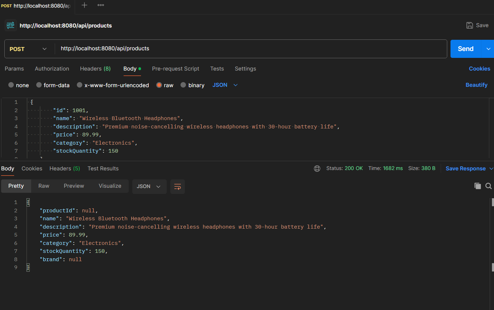
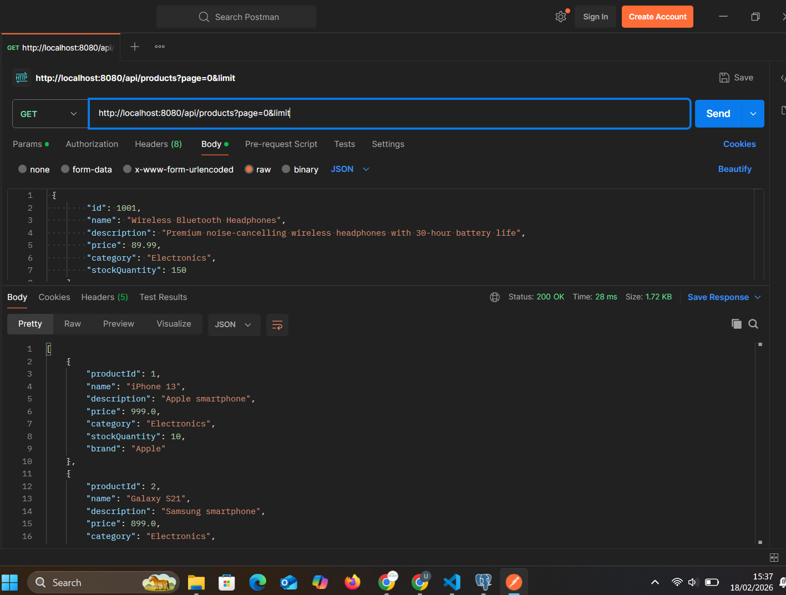
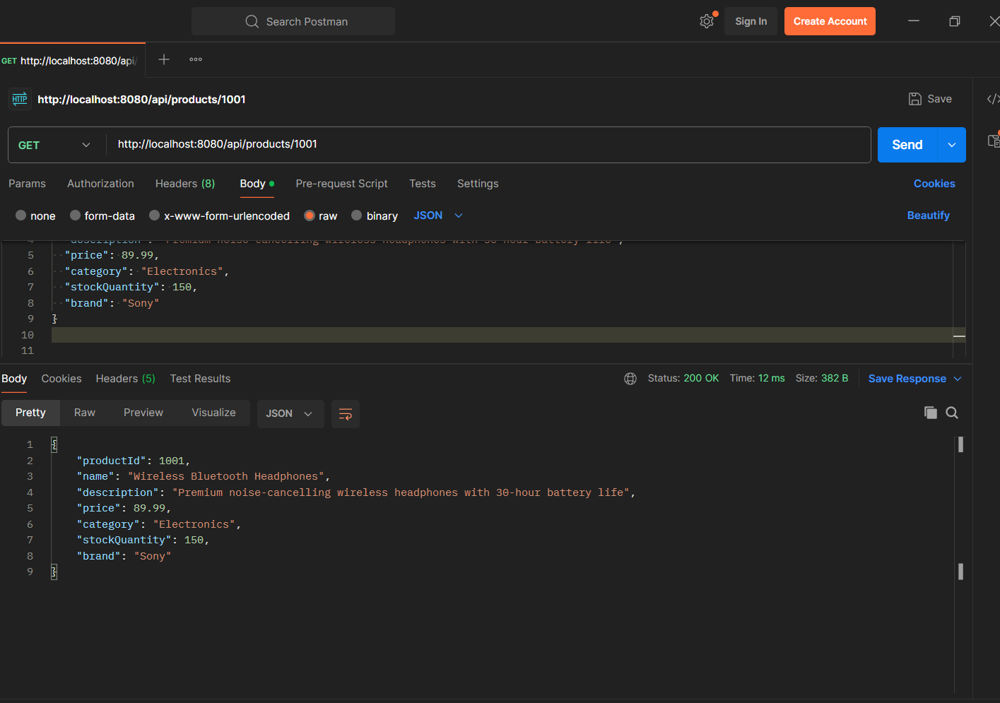
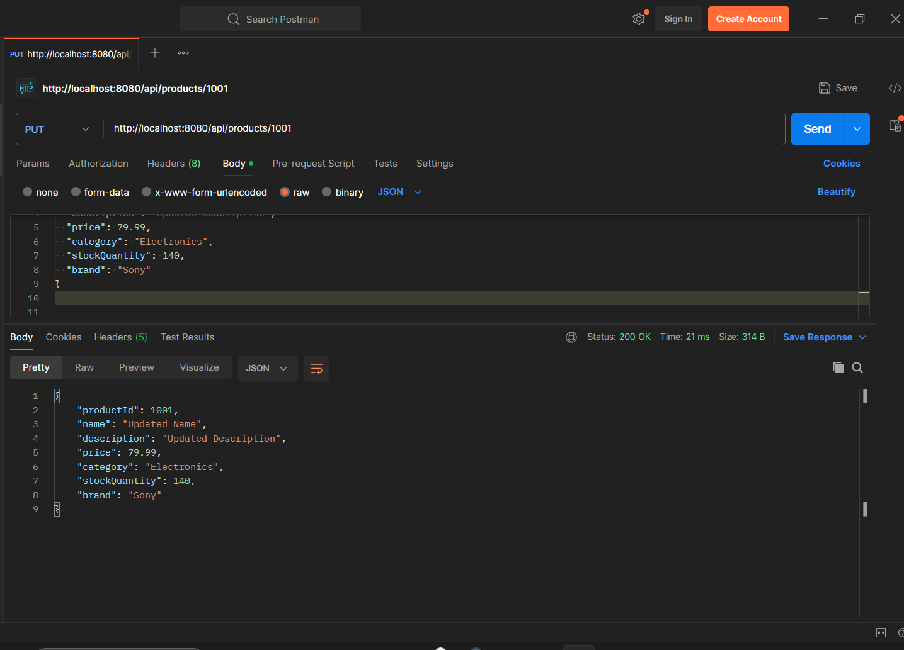
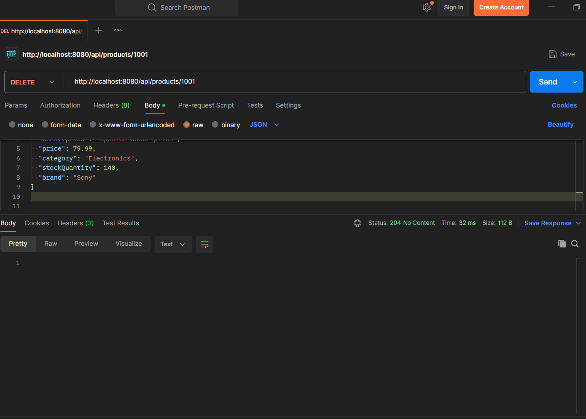

# CRUD Assignment — Product API

**Student:** Uwase Tracy
**ID:** 27105

This project demonstrates basic **CRUD operations** using a REST API tested with Postman.

---

## 1. Create (POST)

Adds a new product to the system.

---

## 2. Read All (GET)

Retrieves all available products.

---

## 3. Read By ID (GET by id)

Retrieves a specific product using its ID.

---

## 4. Update (PUT)

Updates an existing product.

---

## 5. Delete (DELETE)

Removes a product from the system.

---

